challenge description:

a key checker that takes user input and then compares it to the stored password and tells us whether they key is correct or not. objectives are:

1. to find the correct key that is stored in the program,
2. and try to bypass the check altogether

So, let's see what we have here.

running DiE on the file (DiE is the tool that is used for us to get a basic dossier on the file, like type, what compiler did it use, what packer (the thing that's used to encrypt the file while it's inert and unpack it when it runs) it has, and such other stuff), we get:

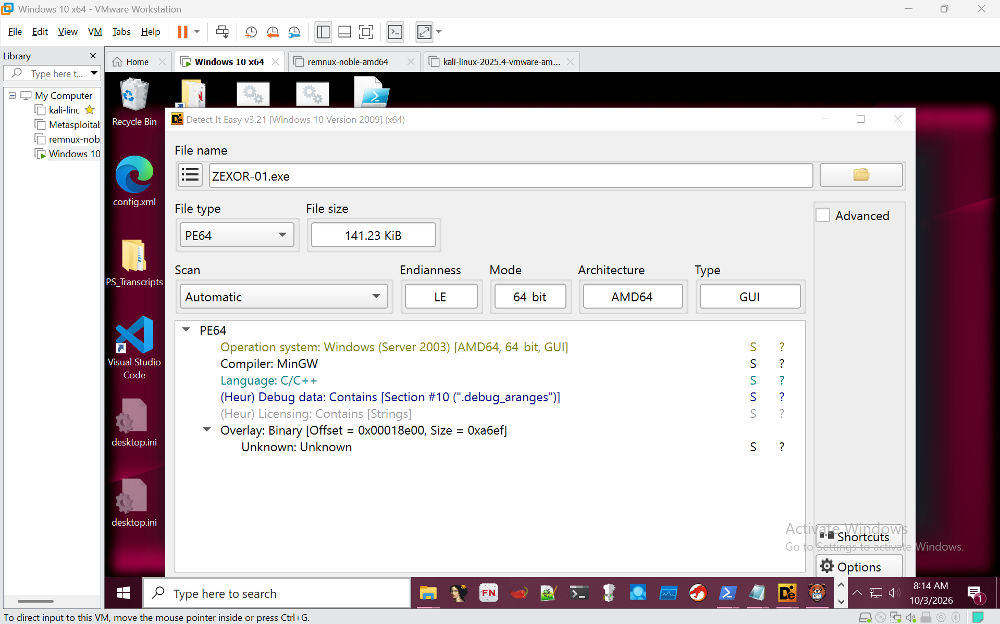

so, we now know that:

1. written in C or C++
2. has debugging data, which means that the function names are not stripped, which means that it will probably be a lot faster for the analysis process later.
3. and has visible strings, which is gonna be JACKPOT for a password checker like this, since it is usually stored as plain text for things like this.

Now, let's run 'strings' on this, and pipe it into a .txt file:

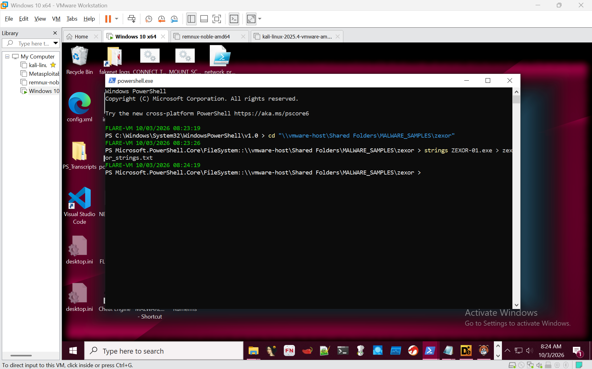

'strings' basically means to extract any plain text that the program has, which may have clues as to what the passwords are and what functions the program has. opening 'zexor_strings.txt', we CTRL+F for keywords like 'key', 'check', 'licence' and other such words that are prevalent in a password checker. we can see an interesting section of strings when we searched for 'key':

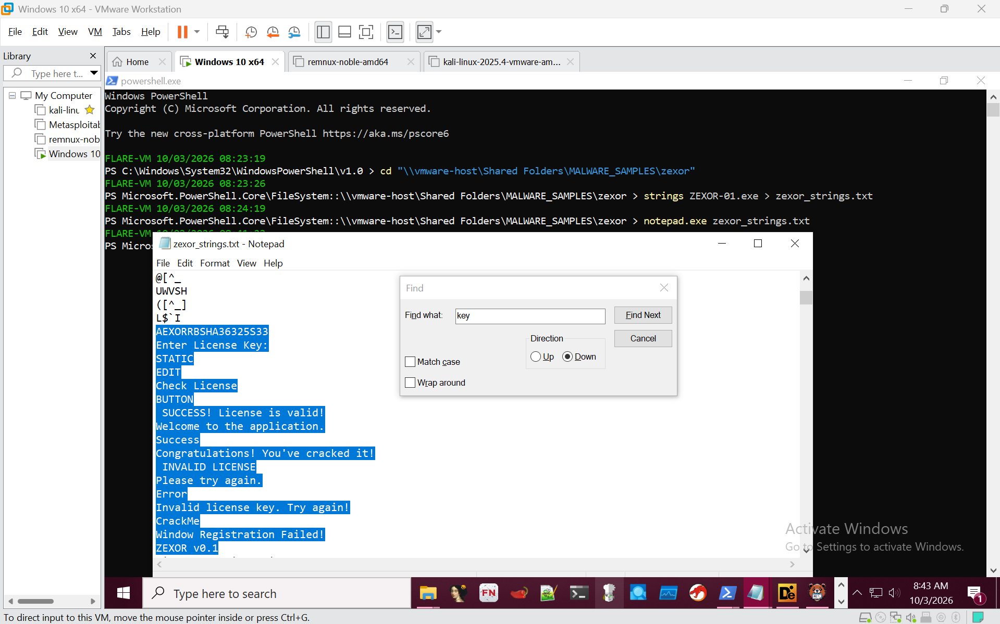

see that weird blob of text with stuff like 'Enter Licence Key' and 'Check Licence'? that might have just been pulled from the meat of the program, where all the juicy stuff are, which means that the password might just be near it. and the most promising candidate is the combination of words and letters 'AEXORRBSHA36325S33', so we will KIV that. Now we will move on to static analysis.

Load up Ghidra, the NSA reverser tool that is open-source, then we import the file into it, and the we import the file into it, and do auto-analysis. We, of course, search the 'main' function for clues, since it is a C/C++ program.

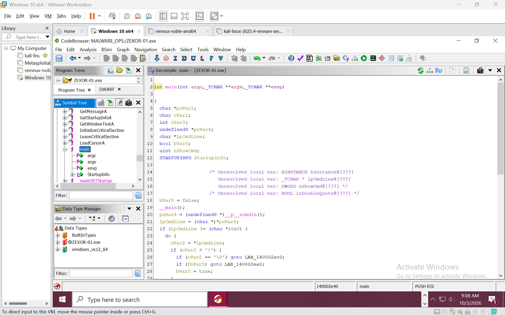

The first half of the function has nothing interesting much, just basic error handling and boilerplate.

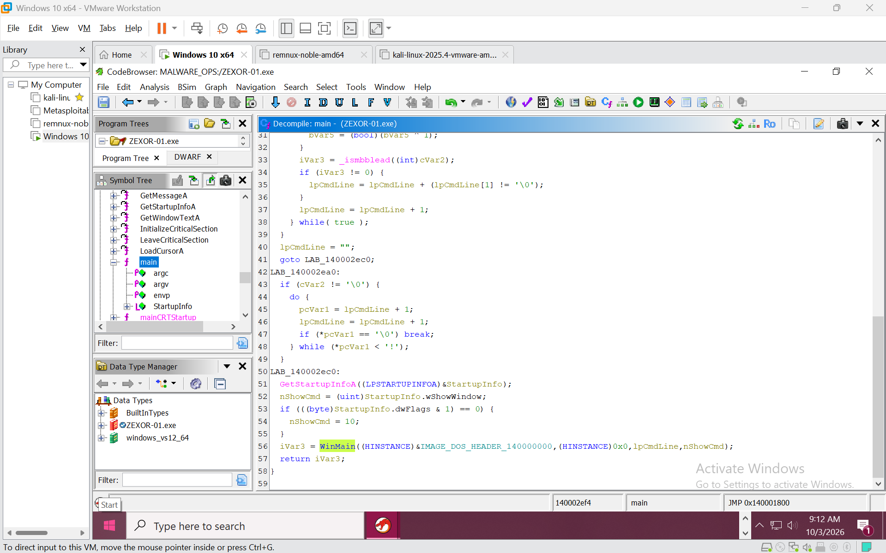

Ok, the second half is a bit more interesting. see the highlighted 'WinMain'? in .exe files, that is the starting point function for GUI-based programs, so it would be interesting to see what is in there. double-click the highlighted, and we go into the 'WinMain' function.

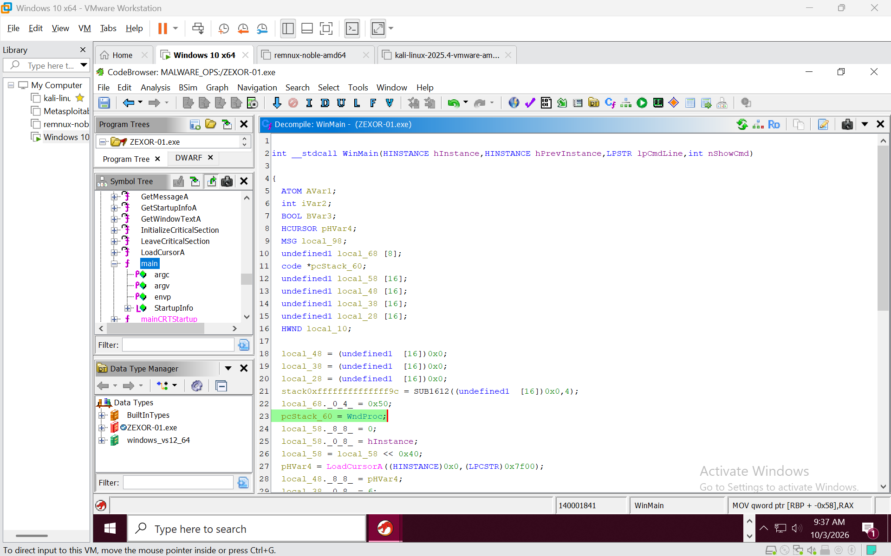

Now, here's the WinMain function, and we can already see that there's something here. there's something called 'WndProc'.

WndProc, according to [learn.microsoft.com](https://learn.microsoft.com/en-us/windows/win32/api/winuser/nc-winuser-wndproc) is :

"A callback function, which you define in your application, that processes messages sent to a window. The **WNDPROC** type defines a pointer to this callback function. The _WndProc_ name is a placeholder for the name of the function that you define in your application."

to TL;DR for illiterate peasants like us, it basically means where our input goes to be processed after we click 'Check' after entering the input. it is like main starts up WinMain, WinMain starts everything in the GUI, and WndProc essentially decides what functions to call when the user interacts with the GUI so that is probably our next function to look into. Like an inverted pyramid of puppeteers. double-click and we jump.

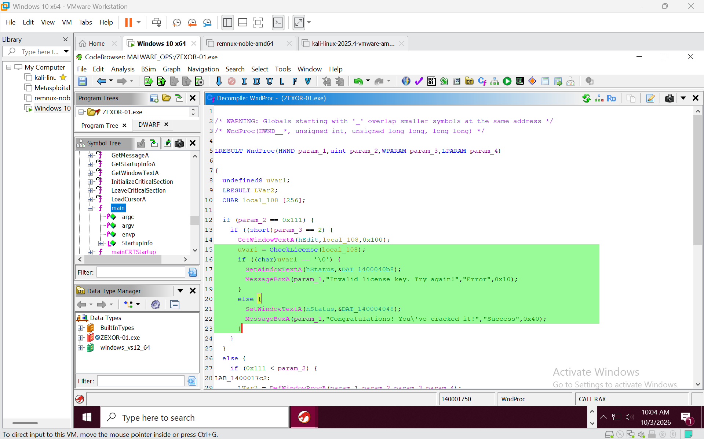

And yes!! we found the REAL main function, where the action happens, and we can see that there is a very suspicious function labelled as 'CheckLicense', which we will be looking at now. Jumping to 'CheckLicense':

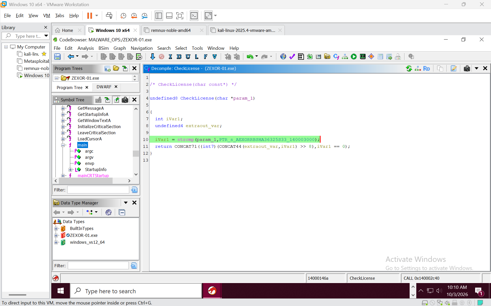

The heart of the CheckLicense function is pretty simple: it uses strcmp to compare between param_1, which is a user input, and some pointer called 'PTR_s_AEXORRBSHA36325S33_140003000'. that means that the real password is stored somewhere that is pointed by the pointer. Now we find where it is stored in the memory by opening the 'listing' window, and then we click on the PTR. 

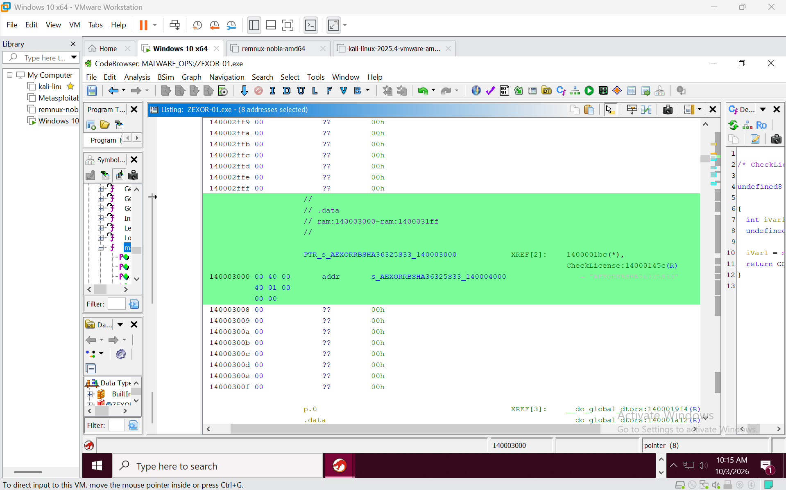

now, we see that 'PTR_s_AEXORRBSHA36325S33_140003000' points to 'AEXORRBSHA36325S33_140004000', which points to a string (actually it's an array, but we'll let it slide) of bytes that is plaintext "AEXORRBSHA36325S33", making us 99% sure that is is the password. also, it is XREF (referenced) to the LicenseCheck function, meaning that it is used in that function.

Let's check if our hypothesis is true by starting up that program and using AEXORRBSHA36325S33 as the key....

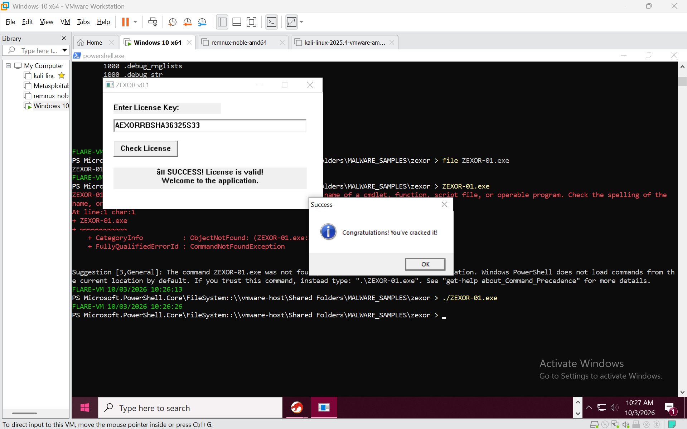

AND YESS!!! IT IS CORRECT!! Now we know that the password is stored in the memory in plaintext form all along, which is a very idiotic move in the situation where we have to build a real licence key checker, but in this scenario, it is perfect for the crackme. Objective one done, we shall continue tomorrow morning

Ok, we are now gonna use x64dbg as the tool to achieve objective 2. Open it and then load the .exe

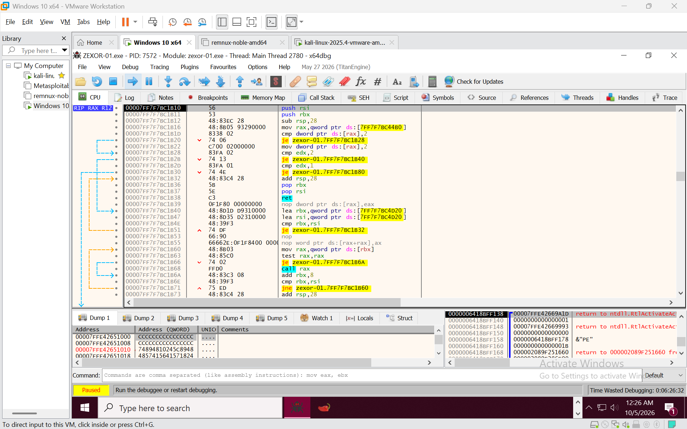

then you can right-click in the biggest window, the 'CPU' one, and then select 'Search for' and then select 'All modules' and then select 'string references' in this Russian Doll of selection. Using the success message that we got in the previous objective ("Congratulations! You've cracked it!"), we can find the exact instructions where it is displayed. Click the only result that appears:

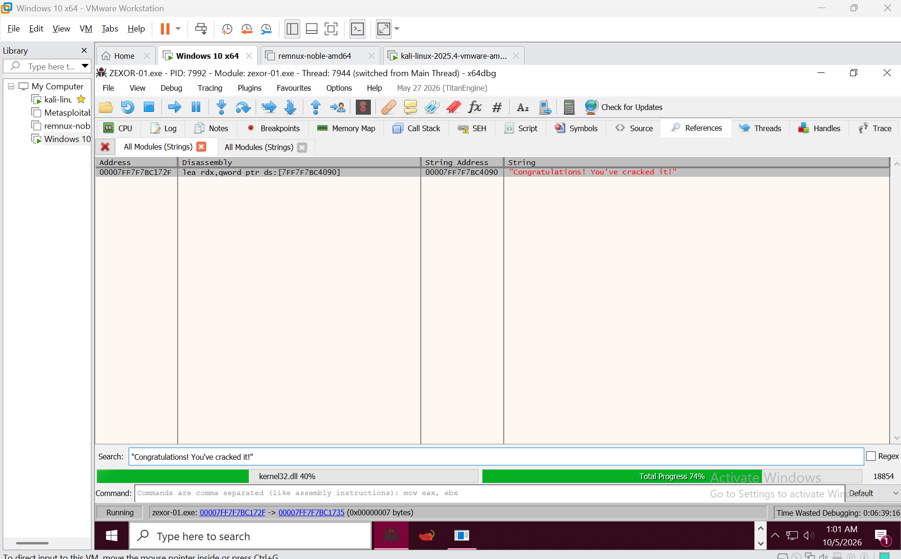

and we now jump to the memory region of the program where it is displayed (like ctrl + f to find the paragraph of an essay, but for disassembly. a program is basically a giant essay that has A LOT of "please refer to paragraph x if you have this condition" scattered throughout the writing).

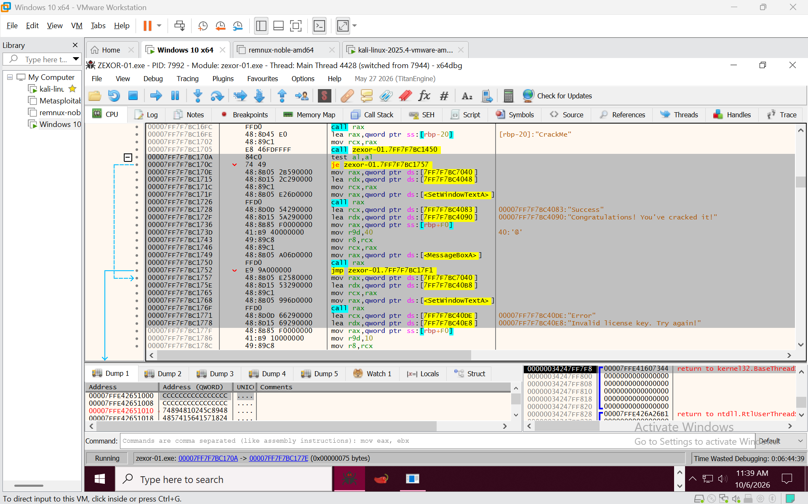

Ok, now that we have jumped here, to the highlighted 'paragraph' of the program, we can now see the heart of the program gloriously exposed to our eyes. if we look at the top of the highlighted blob, we can see that there's a 'test al, al', meaning that the program compares to some values from the al register to another value in the al register (don't ask me how I know; I'm also equally confused. Ask ChatGPT). from what we know, test with 'je' (Jump If Equal, essentially boolean if-else) is usually associated with the branching of the program, which is that if we choose one thing, the program would direct us down one path, and if we choose something else, the program would lead us down another, different path. in this context, we can see and extrapolate that if we enter the correct password, the test will not trigger the jump, and we will fall through into the "Correct!!" message (remember that if a program doesn't have any jumps, it will default to falling through downwards, much like we read an essay), and if we enter the wrong password, we will be forced to jump into the sentence where it gives us the "invalid license key" message. It's like a trapdoor booby trap, but in order to get to the treasure, we HAVE to fall through the trapdoors into the secret chamber containing the treasure, or we'll just walk to our deaths via flaming arrows of "invalid license" messages, respawning again before the trapdoors. the problem is, the trapdoors only open when we say the secret word, which we already have, but that isn't the point of Objective 2. Let's take a refresher, and remember that Objective 2 is to modify the program in such a way that regardless of what we input into the program, it will still give the "correct" message. So, the easiest way to do that is to essentially just remove the trapdoors. how? we'll continue in the morning, when my brain is refreshed. ta-ta....

Ok, now since I have revived myself with plenty of Monster, now let's get into how we're gonna beat this program in order to get it to give us the success message regardless of what we enter into it, much like that one toxic relationship where one partner just thinks that everything that the other partner is telling him is good, even though she's saying outright lies. 

Now, the technique that we'll be using is called patching, which literally means that we'll open up the program, see the hex in it, throw out some, then putting your own hexes in it, much like striking out a few words in an essay. 